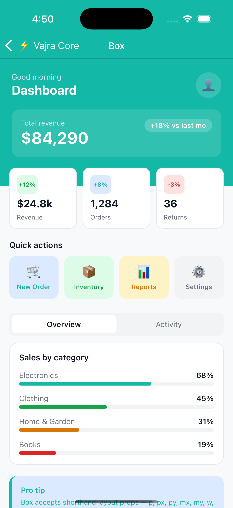
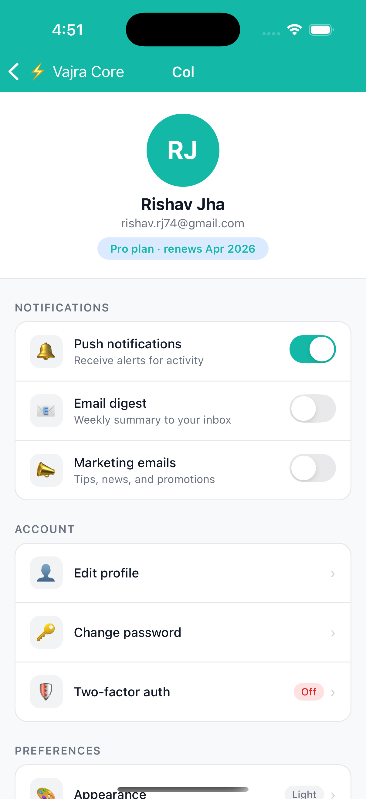
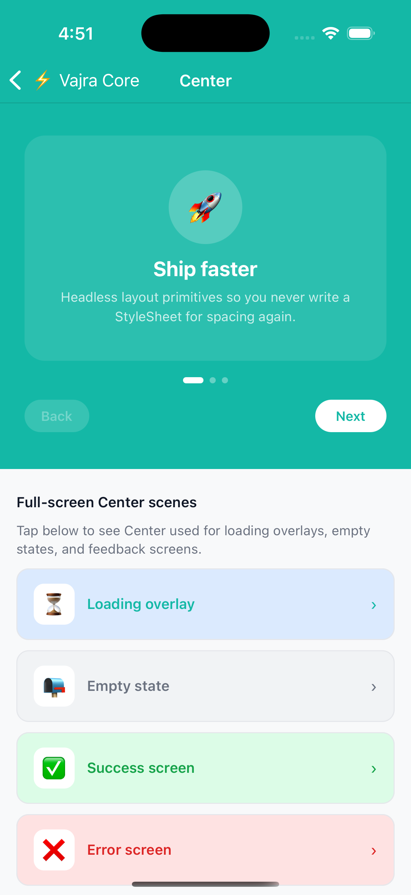
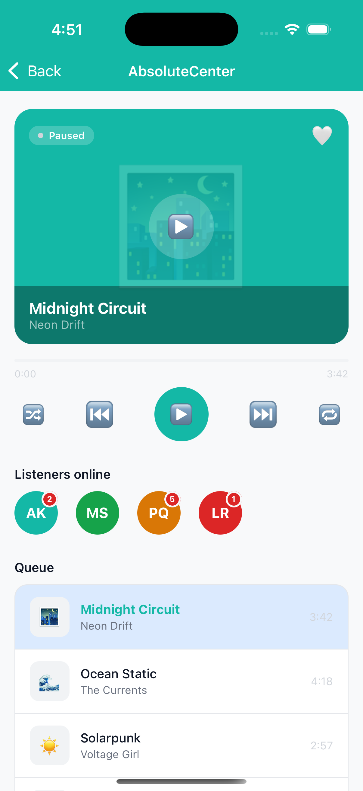
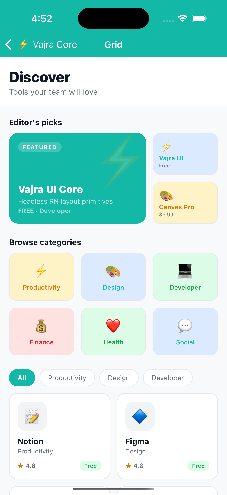
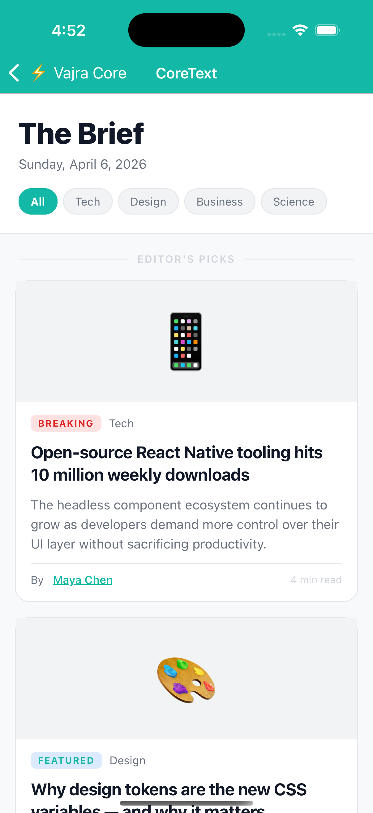
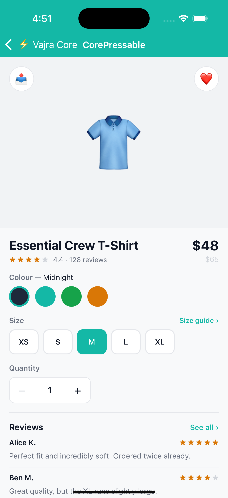
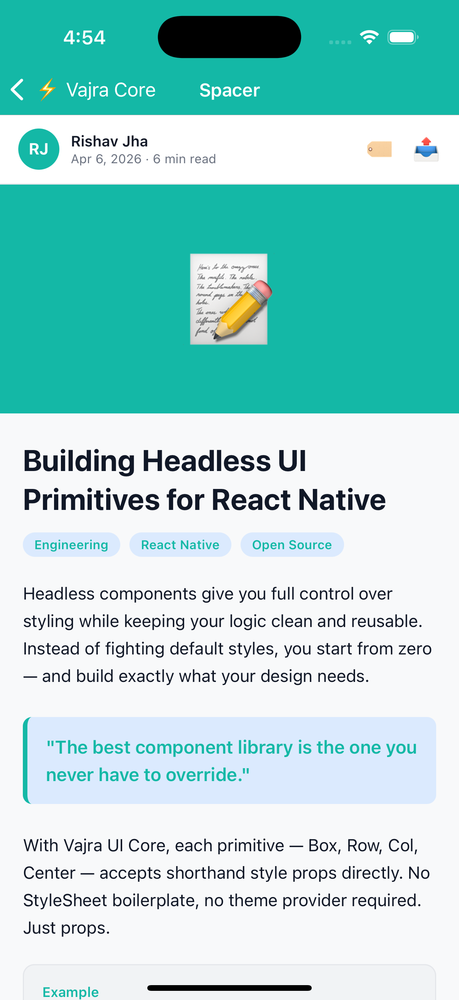
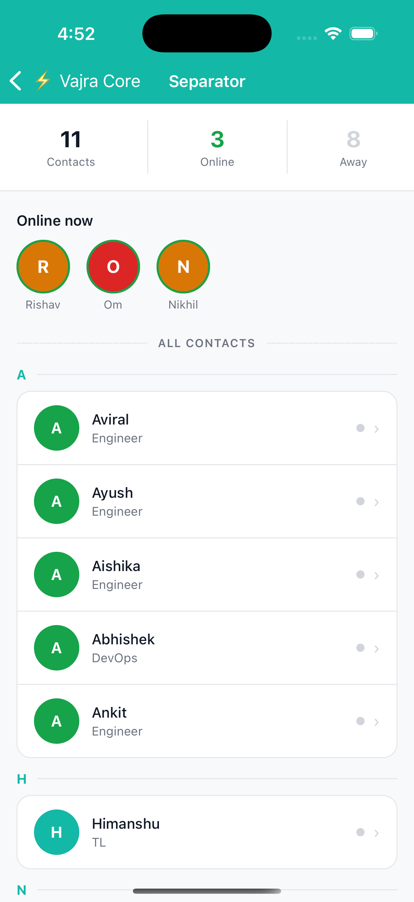
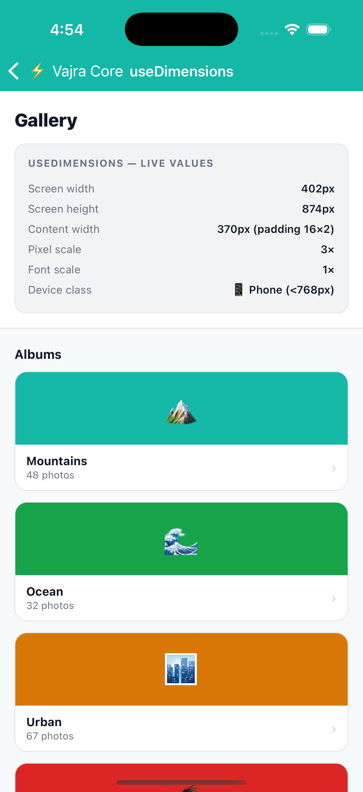

<div align="center">

# Vajra UI Core

**Headless React Native layout primitives.**
No theme. No opinions. Just structure.

Built to be consumed by `vajra-ui` or used standalone when you want layout building blocks without a design system attached.

<br />

&nbsp;&nbsp;
<!-- &nbsp; &nbsp; &nbsp;&nbsp;&nbsp;&nbsp;&nbsp;&nbsp;&nbsp; -->

</div>

---

## Install

```sh
yarn add @devraj-labs/vajra-ui-core
```

`react` and `react-native` are peer dependencies.

---

## Primitives

| Component | Docs | Purpose |
|-----------|------|---------|
| `Box` | [docs/box](./docs/box/box.md) | Foundation `View` with shorthand style props |
| `Row` | [docs/row](./docs/row/row.md) | `Box` preset — `direction="row"` |
| `Col` | [docs/col](./docs/col/col.md) | `Box` preset — `direction="column"` |
| `Center` | [docs/center](./docs/center/center.md) | `Box` preset — centred on both axes |
| `AbsoluteCenter` | [docs/absolute-center](./docs/absolute-center/absolute-center.md) | Absolutely fills parent and centres children |
| `Spacer` | [docs/spacer](./docs/spacer/spacer.md) | Fixed-size empty space |
| `Separator` | [docs/separator](./docs/separator/separator.md) | Horizontal or vertical line divider |
| `CoreText` | [docs/core-text](./docs/core-text/core-text.md) | Headless `Text` with typography props |
| `CoreTextInput` | [docs/core-text-input](./docs/core-text-input/core-text-input.md) | Headless `TextInput` with layout + typography props |
| `CorePressable` | [docs/core-pressable](./docs/core-pressable/core-pressable.md) | Headless `TouchableOpacity` with layout props |
| `Grid` | [docs/grid](./docs/grid/grid.md) | Compound responsive grid (`Grid.Root` + `Grid.Item`) |
| `useDimensions` | [docs/use-dimensions](./docs/use-dimensions/use-dimensions.md) | Screen-aware dimension utilities hook |

---

## Examples

A runnable React Native CLI app lives in [`examples/app/`](./examples/app/). It renders every component in a dedicated screen navigated via a native stack.

```sh
cd examples/app

# iOS
bundle exec pod install --project-directory=ios
npx react-native run-ios

# Android
npx react-native run-android
```

| Screen | Source |
|--------|--------|
| Home | [`examples/app/src/screens/home-screen.tsx`](./examples/app/src/screens/home-screen.tsx) |
| Box | [`examples/app/src/screens/box-example/index.tsx`](./examples/app/src/screens/box-example/index.tsx) |
| Row | [`examples/app/src/screens/row-example/index.tsx`](./examples/app/src/screens/row-example/index.tsx) |
| Col | [`examples/app/src/screens/col-example/index.tsx`](./examples/app/src/screens/col-example/index.tsx) |
| Center | [`examples/app/src/screens/center-example/index.tsx`](./examples/app/src/screens/center-example/index.tsx) |
| AbsoluteCenter | [`examples/app/src/screens/absolute-center-example/index.tsx`](./examples/app/src/screens/absolute-center-example/index.tsx) |
| Spacer | [`examples/app/src/screens/spacer-example/index.tsx`](./examples/app/src/screens/spacer-example/index.tsx) |
| Separator | [`examples/app/src/screens/separator-example/index.tsx`](./examples/app/src/screens/separator-example/index.tsx) |
| CoreText | [`examples/app/src/screens/core-text-example/index.tsx`](./examples/app/src/screens/core-text-example/index.tsx) |
| CoreTextInput | [`examples/app/src/screens/core-text-input-example/index.tsx`](./examples/app/src/screens/core-text-input-example/index.tsx) |
| CorePressable | [`examples/app/src/screens/core-pressable-example/index.tsx`](./examples/app/src/screens/core-pressable-example/index.tsx) |
| Grid | [`examples/app/src/screens/grid-example/index.tsx`](./examples/app/src/screens/grid-example/index.tsx) |
| useDimensions | [`examples/app/src/screens/use-dimensions-example/index.tsx`](./examples/app/src/screens/use-dimensions-example/index.tsx) |

---

## License

MIT
