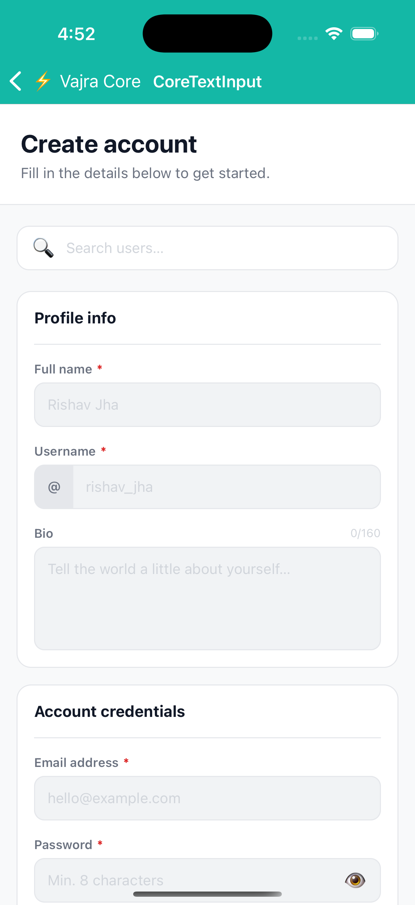

# CoreTextInput

Headless `TextInput` with a subset of Box layout props and typography props combined. No default border, background, or font — style it entirely via props.

Supports `ref` forwarding.

## Preview



> Screenshot from [`examples/app/src/screens/core-text-input-example.tsx`](../../examples/app/src/screens/core-text-input-example.tsx)

## Usage

```tsx
import { CoreTextInput } from '@devraj-labs/vajra-ui-core';

<CoreTextInput
  p={12}
  rounded={8}
  borderWidth={1}
  borderColor="#E5E7EB"
  fontSize={14}
  color="#111827"
  placeholder="Type here…"
  placeholderColor="#D1D5DB"
/>
```

## API

### Layout props

| Prop | Type | Maps to |
|------|------|---------|
| `w` | `DimensionValue` | `width` |
| `h` | `DimensionValue` | `height` |
| `m` `mx` `my` `mt` `mb` `ml` `mr` | `number` | margin variants |
| `p` `px` `py` `pt` `pb` `pl` `pr` | `number` | padding variants |
| `borderWidth` | `number` | `borderWidth` |
| `borderColor` | `string` | `borderColor` |
| `rounded` | `number` | `borderRadius` |
| `bg` | `string` | `backgroundColor` |

### Typography props

| Prop | Type | Maps to |
|------|------|---------|
| `color` | `string` | `color` |
| `fontSize` | `number` | `fontSize` |
| `lineHeight` | `number` | `lineHeight` |
| `fontWeight` | `TextStyle['fontWeight']` | `fontWeight` |
| `letterSpacing` | `number` | `letterSpacing` |

### Input-specific

| Prop | Type | Description |
|------|------|-------------|
| `placeholderColor` | `string` | Shorthand for `placeholderTextColor` |
| `style` | `TextStyle \| TextStyle[]` | Merged last |

Also accepts all native `TextInputProps`.

> `CoreTextInput` does **not** accept flex or position props. Wrap it in a `Box` when those are needed.
